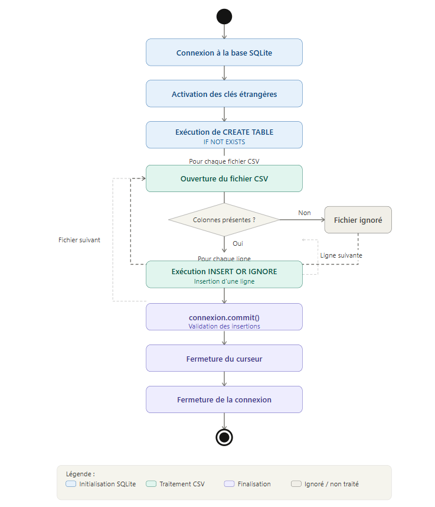
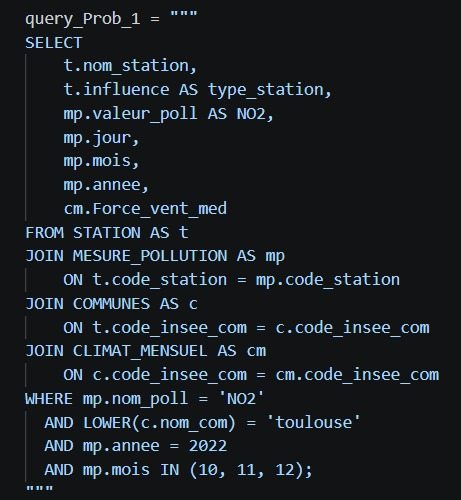
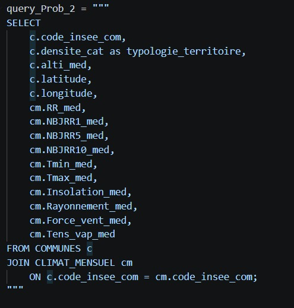
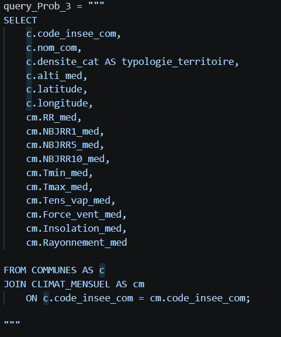
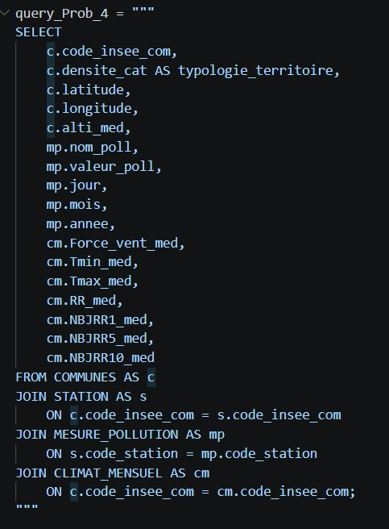

<style type="text/css">
/* Police et corps de texte */
body {
  font-family: 'Segoe UI', Tahoma, Geneva, Verdana, sans-serif;
  font-size: 11pt;
  line-height: 1.6;
  color: #333333;
  background-color: #fcfcfc;
}

/* Titres pro (Bleu nuit) */
h1, h2, h3 {
  color: #2c3e50;
  font-weight: bold;
}

h1 {
  font-weight: 700;
  font-size: 2.5em;
  color: #0f172a;
  text-align: center;
  margin-bottom: 50px;
  letter-spacing: -1px;
}

h2 {
  font-weight: 600;
  color: #2563eb;
  margin-top: 60px;
  padding-bottom: 10px;
  border-bottom: 2px solid #e2e8f0;
}

pre {
  background-color: #0f172a !important;
  color: #f8fafc !important;
  border: none;
  border-radius: 12px;
  padding: 25px;
  box-shadow: 0 10px 25px -5px rgba(0, 0, 0, 0.1);
  margin: 30px 0;
}

table {
  width: 100%;
  background: #ffffff;
  border-radius: 12px;
  border-collapse: collapse;
  overflow: hidden;
  box-shadow: 0 4px 6px -1px rgba(0, 0, 0, 0.05);
  margin: 40px 0;
}

th {
  background-color: #f1f5f9;
  color: #475569;
  font-weight: 600;
  padding: 15px;
  text-align: left;
  border-bottom: 2px solid #e2e8f0;
}

td {
  padding: 12px 15px;
  border-bottom: 1px solid #f1f5f9;
}

tr:hover {
  background-color: #f8fafc;
}

img {
  display: block;
  margin: 40px auto;
  padding: 10px;
  background: #ffffff;
  border-radius: 16px;
  box-shadow: 0 20px 25px -5px rgba(0, 0, 0, 0.05);
  max-width: 90%;
  transition: all 0.3s ease;
}

img:hover {
  transform: translateY(-5px);
  box-shadow: 0 25px 30px -5px rgba(0, 0, 0, 0.08);
}

blockquote {
  margin: 20px 0;
  padding: 20px 30px;
  background: #eff6ff;
  border-left: 5px solid #3b82f6;
  border-radius: 0 12px 12px 0;
  color: #1e40af;
  font-style: italic;
}
</style>


```{r setup, include=FALSE}
knitr::opts_chunk$set(echo = TRUE)
```

# Base de données

## Construction de la base de données


La base de données a été construite à l’aide de SQLite3 et d’un script Python permettant d’automatiser l’ensemble du processus.
Elle repose sur une architecture relationnelle composée de six tables principales :

- REGIONS : contient les codes et noms des régions.

- DEPARTEMENTS : identifiés par leur code, associés à une région via une clé étrangère.

- COMMUNES : informations géographiques et démographiques (population, superficie, densité, altitude, latitude, longitude).

- CLIMAT_MENSUEL : données climatiques moyennes (pluie, températures, vent, ensoleillement, rayonnement).

- STATION : stations de mesure de la qualité de l’air, avec leur typologie (trafic, fond urbain…) et leur localisation.

- MESURE_POLLUTION : mesures journalières des polluants (NO₂, O₃, PM10…), associées à une station.

Les types de données (INTEGER, REAL, TEXT) ont été choisis pour correspondre à la nature des variables.
Les contraintes PRIMARY KEY, FOREIGN KEY et ON DELETE CASCADE assurent l’intégrité référentielle entre les tables et garantissent la cohérence des relations (région → département → commune → station → mesures).

La création et l’alimentation de la base ont été automatisées via une fonction Python factorisée (creation_base()), qui :

- crée une table à partir d’une requête SQL,

- lit un fichier CSV,

- vérifie la présence des colonnes attendues,

- insère les données correspondantes.

Cette factorisation permet d’éviter la duplication de code et facilite l’ajout ou la modification de tables.

```{r , echo=FALSE, out.width="50%", fig.align="center", fig.cap=""}

```

## Extractions de tables depuis la base de données


L’extraction des données nécessaires aux analyses statistiques a été réalisée à l’aide d’un script Python dédié (creationCSV.py).
Ce script automatise l’ensemble du processus en :

- exécutant une requête SQL correspondant à chaque problématique,

- récupérant les résultats sous forme de tuples Python,

- générant automatiquement un fichier CSV contenant les colonnes et les observations extraites.

Chaque problématique du projet est associée à une requête SQL spécifique.
Ces requêtes mobilisent plusieurs tables de la base (COMMUNES, STATION, MESURE_POLLUTION, CLIMAT_MENSUEL)

Pour la problématique 1, l’objectif était d’étudier la relation entre les concentrations de NO₂ et la force du vent pour les stations de Toulouse.
La requête SQL sélectionne :

- le nom et le type de station,

- la valeur du polluant NO₂,

- la date (jour, mois, année),

- la force du vent moyenne,

uniquement pour Toulouse et pour les mois d’octobre, novembre et décembre 2022.

```{r , echo=FALSE, out.width="50%", fig.align="center", fig.cap=""}

```

La problématique 2 vise à analyser l’influence des variables climatiques sur la typologie du territoire.
La requête SQL sélectionne :

- la typologie du territoire (densite_cat),

- les coordonnées géographiques,

- l’altitude,

- les variables climatiques (pluie, températures, vent, insolation, rayonnement).

```{r , echo=FALSE, out.width="50%", fig.align="center", fig.cap=""}

```

Pour la problématique 3, l’objectif était d’identifier les facteurs géographiques et climatiques permettant de distinguer les différents types de territoires.
La requête SQL combine les tables COMMUNES et CLIMAT_MENSUEL afin d’obtenir :

- la typologie du territoire,

- l’altitude,

- les coordonnées géographiques,

- les variables climatiques pertinentes.

```{r , echo=FALSE, out.width="50%", fig.align="center", fig.cap=""}

```

La problématique 4 étudie l’effet conjoint de la typologie du territoire, des conditions météorologiques et des émissions locales sur les concentrations de polluants.
- La requête SQL associe :

- les mesures journalières de pollution,

- les variables climatiques,

- la typologie du territoire,

- les caractéristiques géographiques (latitude, longitude, altitude).


```{r , echo=FALSE, out.width="50%", fig.align="center", fig.cap=""}

```

## Enrichissement de la base de données à partir de nouvelles données trouvées sur le web (facultatif)

Dans le cadre de ce travail, aucun jeu de données supplémentaire n’a été ajouté.

Ce choix se justifie par :

- la richesse des données déjà fournies (pollution, climat, géographie,
typologie),

- la volonté de maintenir une base cohérente et homogène,

- l’objectif de se concentrer sur la qualité des requêtes SQL et des analyses statistiques.

La base repose donc exclusivement sur les données officielles fournies, garantissant une structure claire et adaptée aux problématiques étudiées.


# Statistique descriptive


## Identification de problématiques statistiques

1) Existe-t-il un lien entre la concentration de NO2 et la force du vent dans une station trafic et une station fond urbain à Toulouse ?

2) Comment le climat (pluie, température, ensoleillement, vent) influence‑t‑il le type d’occupation du territoire (zones urbaines, rurales, dispersées) dans une région ?

3) Quels facteurs climatiques et géographiques permettent de distinguer les territoires urbains, les territoires ruraux et les territoires dispersés dans la région étudiée ?

4) Dans quelle mesure la structure du territoire (urbain, rural, dispersé) modifie‑t‑elle la dispersion des polluants atmosphériques en fonction des conditions météorologiques (vent, température, pluie) ?


## Réponses aux problématiques identifiées


### Problématique 1: Existe-t-il un lien entre la concentration de NO2 et la force du vent dans une station trafic et une station fond urbain à Toulouse ?


```{r}
data <- read.csv("toulouse_NO2_vent_2022.csv", sep = ",", header = TRUE)
data_poll <- read.csv("toulouse_NO2_vent_2022.csv", sep = ",", header = TRUE)

hist(data_poll$NO2, 
     main = "Distribution du NO2", 
     xlab = "NO2 (µg/m3)", 
     col = "hotpink", border = "white")

```

On observe que les concentrations de NO₂ sont plus élevées dans les stations de trafic que dans les stations de fond urbain. Cela s’explique par la proximité des sources de pollution, notamment le trafic routier.

```{r}
boxplot(NO2 ~ type_station, data = data_poll,
        main = "NO2 selon le type de station",
        col = c("darkred", "cadetblue1"),
        ylab = "NO2 (µg/m³)")
```

Les concentrations de NO₂ sont nettement plus élevées dans les stations de trafic que dans les stations de fond urbain, ce qui s’explique par la proximité des sources d’émission (véhicules).

```{r}
plot(data_poll$NO2, 
     type = "n",        
     main = "Tendance de l'évolution du NO2",
     xlab = "Temps (observations)",
     ylab = "NO2 (µg/m³)")

grid(col = "gray90", lty = "solid")

lissage <- smooth.spline(data_poll$NO2, spar = 0.7)
lines(lissage, col = "sienna", lwd = 3)

polygon(c(lissage$x, rev(lissage$x)), 
        c(lissage$y, rep(0, length(lissage$y))), 
        col = rgb(160, 82, 45, maxColorValue = 255, alpha = 50), border = NA)
```

On observe des variations de la concentration de NO₂ au cours du temps. Les valeurs ne sont pas constantes et fluctuent selon les conditions, avec des niveaux globalement plus élevés pour les stations de trafic.


```{r}
plot(data$Force_vent_med, type = "l",
     main = "Force du vent au cours des observations",
     xlab = "Observations",
     ylab = "Force du vent (m/s)",
     col = "navyblue",
     lwd = 2)

abline(h = 3.6, col = "violetred3", lty = 2, lwd = 2)

text(x = length(data$Force_vent_med)*0.7, y = 3.6,
     labels = "Valeur constante = 3.6",
     col = "violetred3", pos = 3)
```

La force du vent ne varie pas dans le jeu de données (valeur constante). Il n’est donc pas possible d’analyser son influence sur la concentration de NO₂ .De plus on voit que Max=Min=3.6 donc que le vent est constant !


#### Conclusion


Finalement , il n’a pas été possible d’étudier l’influence de la force du vent, car cette variable est constante dans le jeu de données. Il est donc impossible de mettre en évidence une relation entre la force du vent et la concentration de NO₂.
Une amélioration de cette étude serait d’utiliser des données où la force du vent varie, afin de pouvoir analyser son impact sur la pollution ou alors en prenant plusieurs autres types de polluant comme O3; NO; Pm10 ...et les comparer


### Problématique 2: Comment le climat (pluie, température) influence‑t‑il le type d’occupation du territoire (zones urbaines, rurale)  dans une région ?

```{r}
donnees <- read.csv("typologie_territoire.csv", sep = ",", dec = ".")

par(mar = c(5, 12, 4, 2)) 


boxplot(donnees$Tmax_med ~ donnees$typologie_territoire, 
        data = donnees,
        horizontal = TRUE,        
        las = 1,                 
        col = rainbow(length(unique(donnees$typologie_territoire))), 
        main = "La température influence-t-elle l'installation ?",
        xlab = "Température maximale médiane (°C)",
        ylab = "",              
        cex.axis = 0.7)          


```

On voit clairement que les Centres urbains ont des boîtes positionnées plus à droite (vers les températures élevées). La population semble donc se concentrer prioritairement là où le climat est le plus chaud, alors que les zones rurales sont réparties sur des températures beaucoup plus fraîches.

```{r}
nb_types <- length(unique(donnees$typologie_territoire))
couleurs_rainbow <- rainbow(nb_types)


plot(donnees$Insolation_med, donnees$RR_med,
     col = couleurs_rainbow[as.factor(donnees$typologie_territoire)], 
     pch = 19,           
     cex = 0.8,          
     main = "Arbitrage entre Soleil et Pluie",
     xlab = "Ensoleillement (heures)",
     ylab = "Précipitations (mm)")

legend("topright", 
       legend = levels(as.factor(donnees$typologie_territoire)),
       col = rainbow(7), 
       pch = 19, 
       cex = 0.7, 
       bty = "n") 
```

Ce nuage de points montre que les villes (points colorés groupés) se massent dans le coin 'Bas-Droite' : beaucoup de soleil et peu de pluie. Le monde rural, lui, occupe tout l'espace restant. Cela prouve que le type d'occupation du territoire est fortement lié au climat : l'habitat dense recherche le confort (soleil/sec) tandis que l'habitat dispersé occupe les zones de contraintes.

```{r}

par(mfrow = c(2, 3), mar = c(4, 4, 2, 1)) 

types <- unique(donnees$typologie_territoire)

for (t in types) {
  hist(donnees$RR_med[donnees$typologie_territoire == t], 
       main = t, 
       xlab = "Pluie (mm)", 
       ylab = "Nb Communes",
       col = rainbow(5), 
       border = "white",
       breaks = 20)
}

par(mfrow = c(1, 1))
```

Les histogrammes des zones urbaines s'arrêtent très vite. Il n'y a quasiment aucune ville dans les zones à forte pluviométrie (au-delà de 100mm sur ce graphe). À l'inverse, l'histogramme du Rural dispersé s'étale loin vers la droite. Conclusion : les fortes pluies semblent être un frein à la densification urbaine.


#### Conclusion

En conclusion l'analyse montre que le climat est un facteur important de l'occupation du territoire. La population se concentre prioritairement dans des zones urbaines car il y a  un confort climatique optimal (chaleur et soleil). À l'inverse, l'habitat rural occupe des zones plus rudes, marquées par de plus fortes précipitations. L'organisation de la région résulte donc d'un entre deux entre la recherche de confort pour les zones denses et d'une adaptation aux contraintes naturelles pour les zones dispersées


### Problématique 3: Quels facteurs climatiques et géographiques permettent de distinguer les territoires urbains, les territoires ruraux et les territoires dispersés dans la région étudiée ?

```{r}

donnees <- read.csv("facteurs_géo_climatiques.csv", sep = ",", dec = ".")

boxplot(donnees$Tmax_med ~ donnees$typologie_territoire, 
        main = "Température par territoire",
        xlab = "Type de zone", 
        ylab = "Température (°C)",
        col = c("gold"),
        ) 
```

On voit que les boîtes des villes sont situées plus haut que celles des zones rurales. La température est donc bien un facteur d'attractivité pour les zones denses.

```{r}
moyennes_pluie <- aggregate(RR_med ~ typologie_territoire, data = donnees, mean)

barplot(moyennes_pluie$RR_med, 
        names.arg = moyennes_pluie$typologie_territoire,
        main = "Moyenne de pluie par zone",
        col = "darkolivegreen1",
        cex.names = 0.8) 
```

Les barres montrent que les zones de "Rural dispersé" reçoivent plus de pluie en moyenne. L'habitat dispersé s'adapte mieux aux climats humides que l'habitat urbain.

```{r}
plot(donnees$Insolation_med, donnees$RR_med,
     col = as.factor(donnees$typologie_territoire),
     pch = 19, 
     main = "Relation Soleil / Pluie",
     xlab = "Ensoleillement",
     ylab = "Précipitations (mm)")

legend("topright", legend = unique(donnees$typologie_territoire), 
       col = 1:length(unique(donnees$typologie_territoire)), pch = 19, cex = 0.6)
```

On observe que les points des villes sont regroupés dans les zones de fort ensoleillement et faible pluie, alors que les zones rurales occupent tout le reste du graphique

Ce graphique montre que l'urbanisation est "bloquée" par l'altitude : les villes sont en bas (plaines), alors que seul l'habitat dispersé monte sur les sommets.

#### Conclusion

L'analyse démontre que l'occupation du territoire suit une logique climatique stricte. L'urbanisation dense s'est concentrée dans les zones de plaines, plus chaudes et abritées, tandis que l'habitat rural occupe les zones de contraintes (vent fort, pluviométrie élevée, froid). Le climat agit donc comme un déterminant physique majeur : il dicte la densité humaine en favorisant le confort urbain au détriment des zones exposées.


### Problématique 4: Dans quelle mesure la structure du territoire (urbain, rural, dispersé) modifie‑t‑elle la dispersion des polluants atmosphériques en fonction des conditions météorologiques (vent, température, pluie) ?

```{r}
donnees <- read.csv("influence_territoire_polluant.csv", sep = ",", dec = ".")

boxplot(valeur_poll ~ typologie_territoire, data = donnees,
        col = c("firebrick", "steelblue", "darkolivegreen3"),
        main = "Pollution selon le type de territoire",
        xlab = "Typologie du territoire",
        ylab = "Concentration du polluant (µg/m³)")
```

Ce premier graphique met en évidence une signature spatiale très marquée de la pollution. On observe une hiérarchie claire entre les territoires : les zones représentées en rouge affichent une médiane de concentration significativement plus élevée que les zones vertes. Cette disparité confirme que la source d'émission est intrinsèquement liée à l'occupation du sol (densité urbaine, axes routiers ou zones industrielles). La présence de moustaches étirées et de valeurs aberrantes pour certains territoires indique une forte réactivité aux épisodes de blocage atmosphérique, où les polluants s'accumulent localement au lieu de se disperser.

```{r}
plot(donnees$Force_vent_med, donnees$valeur_poll,
     col = as.factor(donnees$typologie_territoire),
     pch = 19,
     main = "Effet du vent sur la pollution",
     xlab = "Force du vent (m/s)",
     ylab = "Concentration du polluant")
legend("topright", legend = unique(donnees$typologie_territoire),
       col = 1:length(unique(donnees$typologie_territoire)), pch = 19, cex = 0.7)
```

Le nuage de points révèle une relation inversement proportionnelle entre la force du vent et la concentration du polluant. Il existe une probabilité très élevée de trouver des pics de pollution uniquement lorsque le vent est inférieur à un certain seuil (souvent 2-3 m/s). C’est ce qu’on appelle l’effet de dispersion : plus la vitesse du vent (Force_vent_med) augmente, plus le volume d'air dans lequel le polluant se dilue est grand. Les points de couleur isolés en haut à gauche du graphique représentent les situations à risque maximal : une forte source d'émission combinée à une stagnation totale de la masse d'air.

```{r}
plot(donnees$Tmax_med, donnees$valeur_poll,
     col = as.factor(donnees$typologie_territoire),
     pch = 19,
     main = "Température et pollution",
     xlab = "Température maximale (°C)",
     ylab = "Concentration du polluant")
```


Ce graphique permet d'identifier le régime de pollution. Si l'on observe une montée des points vers la droite (températures élevées), nous sommes face à un polluant secondaire (type Ozone) dont la formation est catalysée par le rayonnement solaire. À l'inverse, si les concentrations les plus fortes sont regroupées sur la gauche (températures basses), cela traduit un phénomène d'inversion thermique. Dans ce second cas, l'air froid reste piégé au sol, empêchant toute ascension verticale des polluants. C'est souvent à ce moment que les probabilités de dépasser les seuils d'alerte sont les plus fortes, car les émissions de chauffage s'ajoutent au trafic routier.

```{r}
plot(donnees$RR_med, donnees$valeur_poll,
     col = as.factor(donnees$typologie_territoire),
     pch = 19,
     main = "Pluie et polluants",
     xlab = "Précipitations (mm)",
     ylab = "Concentration du polluant")
```

C'est ici que l'on observe la tendance la plus prédictive : l'effet de "nettoyage" par la pluie. Le graphique montre une chute brutale des concentrations dès les premiers millimètres de pluie (RR_med). Statistiquement, la probabilité d'observer un pic de pollution par temps de pluie est quasi nulle, car les gouttelettes captent les particules en suspension et les rabattent au sol (lessivage). Les valeurs de pollution les plus critiques sont systématiquement associées à un cumul de précipitations de 0 mm, confirmant que la sécheresse est un facteur aggravant majeur pour la persistance des polluants.

```{r}
boxplot(valeur_poll ~ alti_med, data = donnees,
        main = "Altitude et pollution",
        col = "wheat2")
```

Le boxplot par classes d'altitude montre une tendance à la baisse des concentrations à mesure que l'altitude (alti_med) augmente. Ce phénomène s'explique par l'éloignement des sources d'émissions primaires, généralement situées dans les plaines ou les fonds de vallées. Les zones de basse altitude agissent comme des réceptacles où la pollution s'accumule par gravité (air froid plus dense) ou par concentration humaine. Ce graphique confirme que l'altitude agit comme un régulateur naturel, offrant une qualité d'air statistiquement plus stable et moins soumise aux pics de pollution anthropiques.

#### Conclusion

L'analyse de ce jeu de données démontre que la qualité de l'air sur un territoire donné n'est jamais le fruit du hasard, mais résulte d'une interaction constante entre l'activité humaine et les conditions naturelles. En premier lieu, la typologie du territoire fixe le niveau de base de la pollution : les zones urbaines et industrielles agissent comme des foyers d'émissions critiques où les concentrations sont structurellement plus élevées. Cependant, ce sont les facteurs météorologiques qui déterminent si ces polluants stagnent ou disparaissent.

L'enseignement le plus concret de ces graphiques réside dans le pouvoir "nettoyant" de l'atmosphère. On observe que le vent et la pluie sont les variables les plus fiables pour anticiper une amélioration de l'air. La probabilité d'observer un pic de pollution devient quasiment nulle dès que les précipitations apparaissent (phénomène de lessivage) ou que la force du vent augmente (phénomène de dispersion). Enfin, l'altitude joue un rôle de filtre protecteur, les zones élevées étant statistiquement mieux préservées grâce à une meilleure circulation de l'air et un éloignement des sources de trafic. En résumé, si l'homme pollue davantage en ville et à basse altitude, la météo reste le premier régulateur capable de dissiper ces concentrations de manière radicale.


