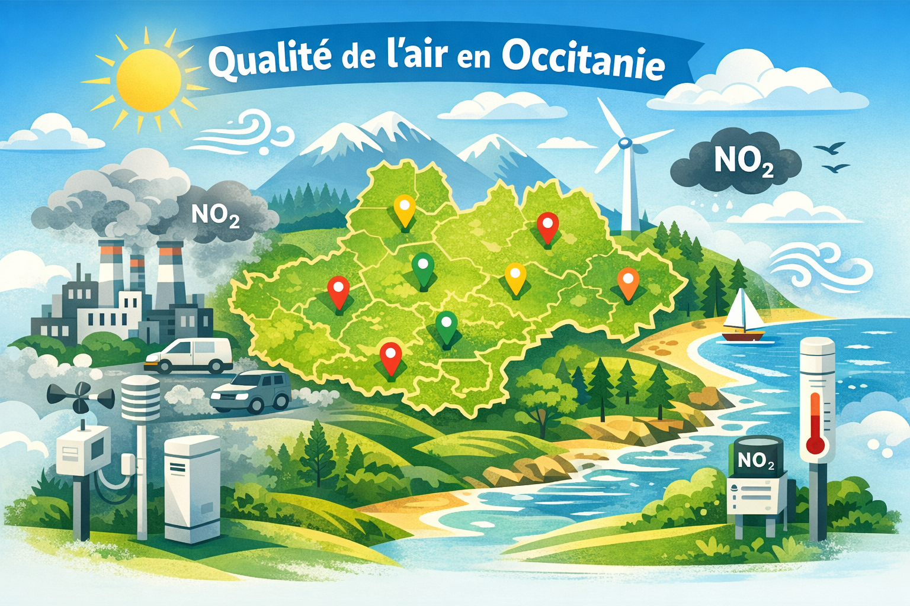

Analyse de la Qualité de l’Air en Occitanie — Description Académique
Ce projet s’inscrit dans une démarche de Data Engineering appliquée à l’étude environnementale. Il consiste à intégrer, structurer et analyser des données climatiques, géographiques et atmosphériques relatives à la région Occitanie.
Un pipeline ETL permet d’ingérer et de nettoyer des fichiers CSV hétérogènes avant leur intégration dans une base de données relationnelle SQLite, modélisée selon les principes de normalisation et d’intégrité référentielle.
Des requêtes SQL analytiques sont ensuite mobilisées pour produire des jeux de données répondant à plusieurs problématiques scientifiques, notamment l’étude des interactions entre conditions météorologiques, typologie territoriale et concentration en polluants (NO₂).

Technologies Utilisées
Python 3 — Scripts ETL et automatisation
Pandas — Nettoyage, filtrage et préparation des données
SQLite — Modélisation relationnelle et stockage structuré
SQL — Jointures, agrégations et extraction analytique
CSV — Sources brutes et datasets produits
